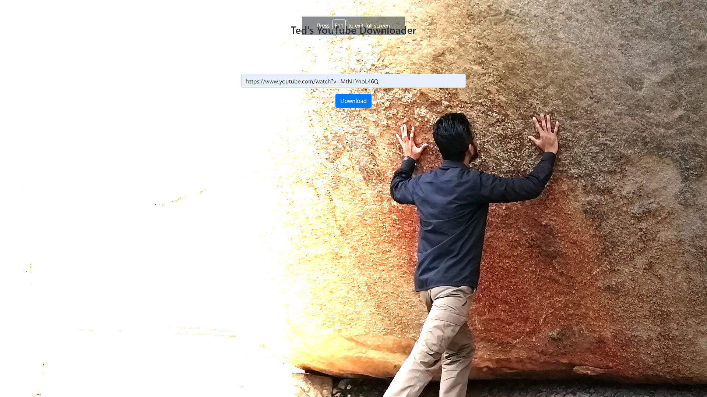

# YouTube-Downloader
A Node.js application to download YouTube videos that are not regionally restricted, private or rented.

## Getting started
You need to have Node.js installed on your system. Download it from [Node.js Downloads](https://nodejs.org/en/download/) based on the system you're using. 

Clone this repository and navigate to folder `server` which has the file `index.js` which is the server file and `package.json` which has the metadata about the project including the dependencies. 

In this folder, run the command -

`npm install` to install all the dependent modules. And once the modules are installed successfully, start the server by running the command - `node ./index.js` and open your browser with URL `http://localhost:3000` to see the below landing page

Paste the video link and download your favorite videos.

### Note
It is not legal to download videos from YouTube unless the video is allowed to be downloaded. Use this application wisely.

### To-do
 - Error handling page.
 - A 'thank you' page/notification after a successful download.

### Pull requests and issues
  - Feel free to raise issues if something is not working properly. 
  - Feel free to fork the repository and raise pull requests with your modifications. If it is a good addition then it would be merged along with due credits.
  
Happy coding!
